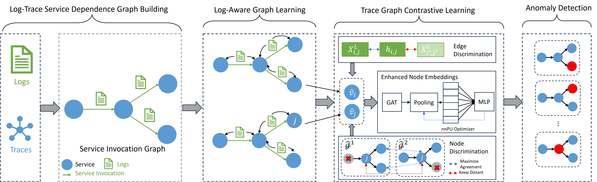

# LogTraceGuard

**LogTraceGuard** is a log-aware trace graph contrastive learning framework for anomaly detection in microservice systems. It combines multi-granularity contrastive learning, graph neural networks, and PU learning to detect root causes of system failures using logs, metrics, and trace structures.

## Architecture



## 🚀 Key Features
- **Log-aware Graph Encoder**: Node and edge features are fused with service-level logs.
- **Multi-Granularity Contrastive Learning**: Supports node-, edge-, and graph-level representation consistency.
- **PU Learning Classifier**: Learns from partially labeled data with only positive and unlabeled samples.
- **Topology-Aware Augmentations**: DropNode-based graph view generator for robustness.
---

## 📦 Repository Structure

```
logtraceguard/
├── main.py                  # Entry point script
├── config/default.yaml     # YAML configuration
├── models/                 # Model definitions
│   ├── encoder.py          # Log-aware GNN (LogGNN)
│   ├── contrastive.py      # Contrastive learning modules
│   ├── pu_classifier.py    # PU loss classifier
│   └── logtraceguard.py    # Integrated model wrapper
├── train/                  # Training pipeline
│   ├── train_pipeline.py   # Main training loop
│   └── augmentations.py    # Graph view generator
├── utils/                  # Utility functions
│   ├── config.py           # YAML parser
│   └── evaluation.py       # Metric calculators
├── datasets/               # Two public datasets
├── baselines/              # Comparison methods and scripts
├── experiments/            # Ablation configs and results logging
│   ├── run_ablation.py     # Run and save ablation results
│   └── ablations/*.yaml    # Module- and modality-level configs
├── deploy/                 # Inference and TorchScript export
├── logs/                   # Auto-generated experiment logs & CSV
└── .gitignore              # Git exclusions (logs, checkpoints, outputs, etc.)
```

---

## 🚀 Quick Start

### 1. Install Dependencies
```bash
pip install -r requirements.txt
```

### 2. Launch Training
```bash
python main.py --config config/default.yaml --mode train
```

### 3. Run Evaluation
```bash
python main.py --config config/default.yaml --mode test
```

---

## 📌 Configuration
Set hyperparameters and loss weights in `config/default.yaml`:
```yaml
model:
  input_dim: 128
  node_dim: 64
  edge_input_dim: 32
  edge_dim: 32
  gnn_layers: 2
  use_lag: true
  use_gat: true

loss_weights:
  contrastive_graph: 1.0
  contrastive_node: 0.5
  contrastive_edge: 0.5
  pu: 1.0

contrastive:
  temperature: 0.5
  use_node: true
  use_edge: true

input:
  use_logs: true
  use_traces: true
```


## 📂 Dataset

This repo does not include real trace/log data by default. You can:

1. Download open-source datasets (e.g., Alibaba Trace, DeathStarBench)
2. Use `datasets/preprocess_logs.py` to convert logs to structured features
3. Use `datasets/dataset.py` to generate PyG-compatible trace graphs

We also provide sample synthetic traces in `datasets/sample/`.

---

## 🧪 Ablation & Parametric Experiments

You can find ablation experiments and hyperparameter sweeps in the `experiments/` directory:

```bash
python experiments/run_ablation.py --config experiments/ablations/wo_edge.yaml
python experiments/run_ablation.py --config experiments/ablations/wo_graph.yaml
```

All results will be logged to `logs/` folder and can be visualized using matplotlib or pandas.

---

## 📦 Deployment

Export trained models via TorchScript for serving:
```bash
python deploy/inference.py --config config/default.yaml --checkpoint checkpoints/best_model.pt --output model.ts
```
Supports batch prediction from logs/graph input.

---

## 📊 Evaluation Metrics

- **Precision**, **Recall**, **F1-Score**, **AUROC**
- Results are printed during `--mode test`

---


## 📬 Contact
For questions, please contact: `2023102110028@whu.edu.cn`